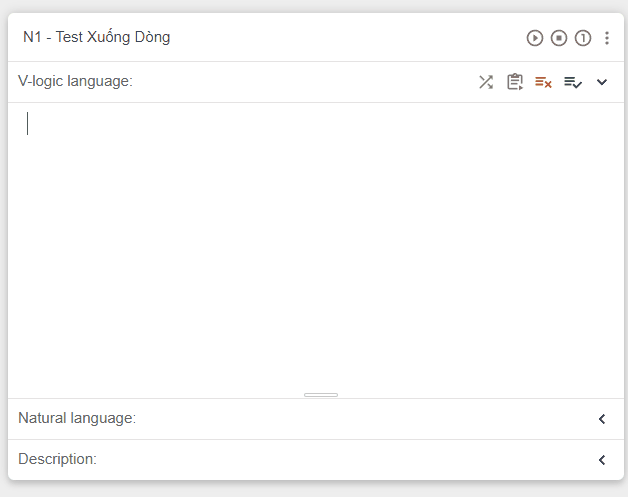
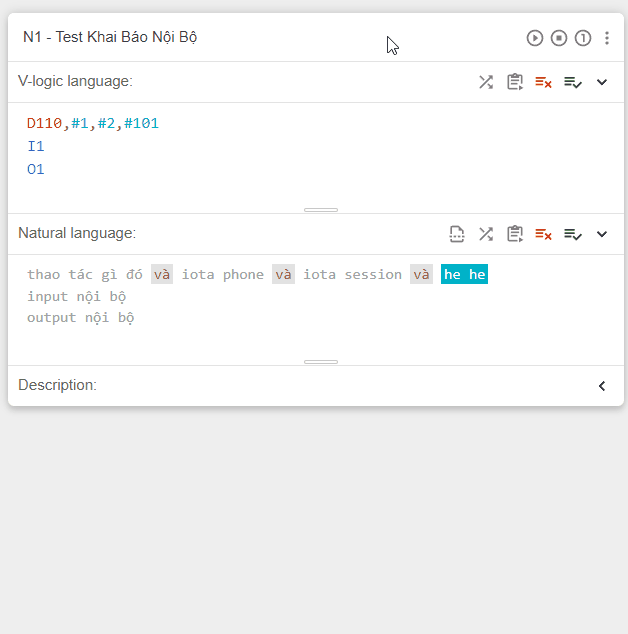
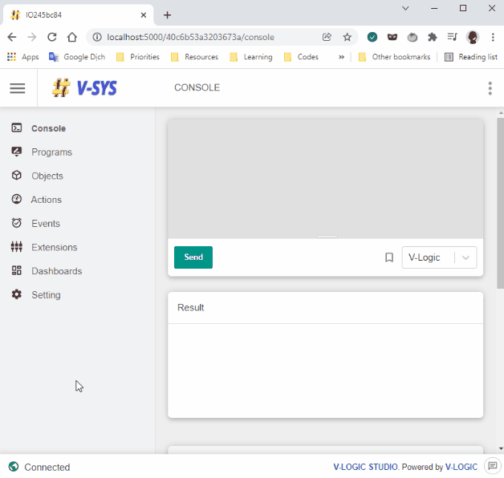

### Các chức năng mới:

1. Xuống dòng theo khoảng cách của dòng hiện tại:

Giờ đây khi xuống dòng mới thì khoảng cách sẽ tự động canh theo khoảng cách của dòng hiện tại.

2. Khai báo linh hoạt hơn với các định nghĩa nội bộ của mỗi chương trình:

Những gì trước đây không có nơi để khai báo thì sẽ khai báo tại khu vực `Local Define`

Trong chương trình, các khai báo `nội bộ` có ưu tiên cao hơn các khai báo `toàn cục`. Ví dụ biến toàn cục #101 khai tên "name A", N1 có khai báo nội bộ #101 là "name B" thì trong chương trình khi dịch sẽ ưu tiên dịch thành "name B" khi có #101

Mức ưu tiên đối với độ dài ký tự khai báo cũng tương tự.

Hỗ trợ:

- Biến nội bộ. Ví dụ: #1, #2, #3,...
- Input output nội bộ: I1, I2, O1, O2,...
- Các lệnh D đại diện cho N. Ví dụ: D110, D120,...

3. Tạo sự kiện IOTA từ trang V-logic Studio:

Để giảm bớt thao tác khi tạo sự kiện quét QR IOTA, thông tin địa chỉ IOT, mã khóa API và một số tham số sẽ truyền đến trang tạo sự kiện IOTA bằng đường URL Params

Đã gửi tham số vào URL. Đợi Huy hỗ trợ fill vào form các tham số từ URL

### Fix bug sửa lỗi:

- Lỗi dịch sai do phân biệt chữ cái hoa thường (Vào lúc, ...)
- Lỗi dịch sót một vài lệnh
